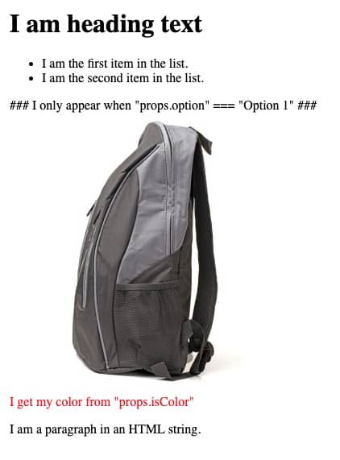

# Element Demo Block



## What

A basic Element demo block.

## How

```
npm install
npm start
```

## Build

```
npm run build
```

## Test

```
npm run test:watch
```

## Default Props

| Prop Name   | Type             | Default Value                                | Description                                                                   |
| ----------- | ---------------- | -------------------------------------------- | ----------------------------------------------------------------------------- |
| header.show | boolean          | `true`                                       | Hides the heading element when `false`.                                       |
| header.text | string           | `'I am heading text'`                        | Text that appears within the heading element.                                 |
| listItems   | array of objects | `{string: '...'},{string: '...'}]`           | Each string key appears as a list item within the unordered list.             |
| option      | array of strings | `'Option 1'`                                 | Determins what content is returned from the OptionDetails component.          |
| imageUrl    | string           | See configs for full string.                 | A cloudinary image url.                                                       |
| textColor   | string           | `'#FF0000'`                                  | Color applied to the text under the image element.                            |
| htmlString  | string           | `<p>I am a paragraph in an HTML string.</p>` | A string of HTML that injected within the element at the bottom of the block. |
